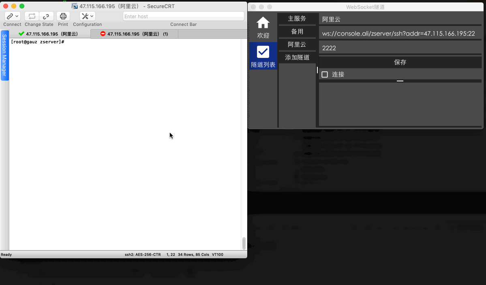

# ztun WebSocket隧道 客户端

TCP over WebSocket

```
[tcp 服务,如sshd]
 |
 |  <= TCP
 |
[ztun 服务端]
 ||
 || <= WebSocket
 ||
[nginx等]
 ||
 || <= WebSocket
 ||
[ztun客户端]
 |
 | <= TCP
 |
[tcp客户端，如secureCRT]
```

## 用法

1. 在tcp服务器端运行(默认端口8000) 
```
./zserver -conf configs/
```
1. 在本地打开ztun客户端
```yaml
./ztun
```
1. 填写监听端口和ztun的WebSocket地址,保存
1. 测试连接

## niginx配置实例
```yaml
upstream websocket {
    server 127.0.0.1:8000;
}
server {
        listen  80;
        server_name  console.ali;

        index index.html;
        set $root_path '/opt/code/zserver/www';
        root $root_path;
        location ~ / {
        proxy_pass http://websocket;
        proxy_http_version 1.1;
        proxy_set_header Upgrade $http_upgrade;
        proxy_set_header Connection $connection_upgrade;
        proxy_read_timeout      6000s;
        proxy_connect_timeout   300s;
    }


}
```

